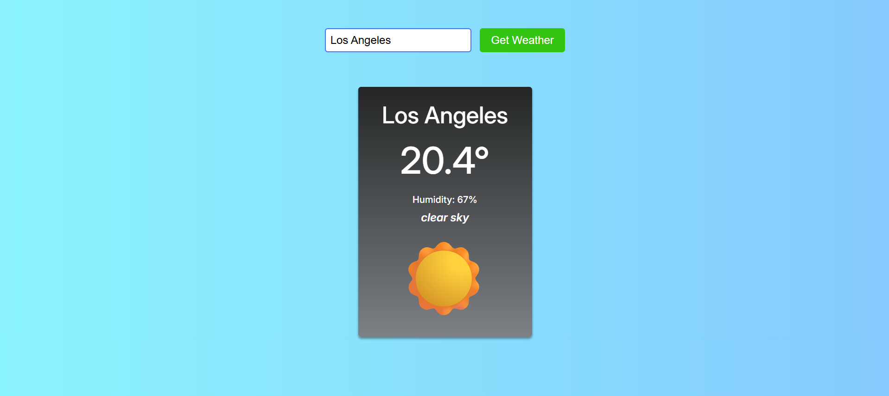

# 🌤️ Weather App

A simple and clean weather app that lets users check the current weather conditions in any city using the OpenWeatherMap API.

## 🚀 Features

- Search for any city to get real-time weather data
- Displays:
  - City name
  - Temperature in Celsius
  - Humidity
  - Weather description
  - Weather emoji based on condition

## 🛠️ Technologies Used

- HTML
- CSS
- JavaScript
- [OpenWeatherMap API](https://openweathermap.org/api)

## 📸 Screenshot

